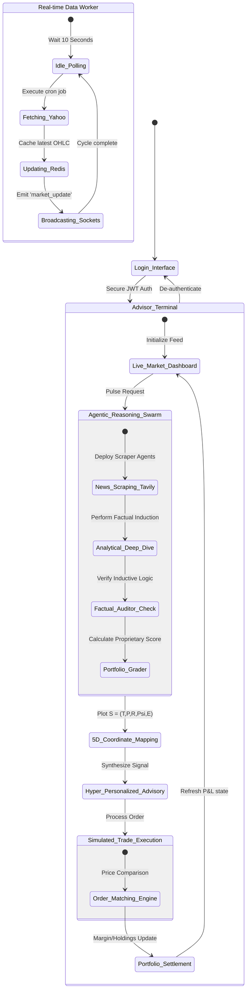

# Proper State Diagram: Context-Aware Agentic Advisor

This documentation provides an institutional-grade UML State Diagram of the **Nifty 50 Agentic Simulation** environment, verified against the project's background polling and multi-agent reasoning architecture.

---

## Technical State Diagram (Mermaid)

---

## State Descriptions (Institutional Accuracy)

### 1. Real-time Data Worker (Background)
A persistent background state managed by `node-cron`. Every 10 seconds, the system transitions from **Idle** to **Fetching**, then **Caching** in Redis, and finally **Broadcasting** price ticks to all connected clients via Socket.io.

### 2. Login Interface
The gateway state. It manages the transition from anonymous access to an authenticated session, which is required to trigger the high-compute AI agents.

### 3. Agentic Reasoning Swarm (Agents 1-6)
A complex composite state representing the sequential pipeline in `sentimentService.js`.
*   **Scraping (Tavily):** Ingests 15+ data points from Domestic, Sectoral, and Global sources.
*   **Induction & Auditing:** Performs the logic-based deduction (Factual Induction) and fact-checks it against raw data.
*   **Grading:** Translates unstructured reasoning into the final structured score.

### 4. 5D Coordinate Mapping
The logic-heavy state where the graded results are plotted into the 5D axis (Time, Stock, Sector, Perception, Relevance). This state transforms the "What" into the "Why" for the retail investor.

### 5. Simulated Trade Execution
Manages the lifecycle of simulated Market and Limit orders. It ensures that the **Portfolio Settlement** state correctly reflects the new average cost and capital levels once the trade is finalized.
