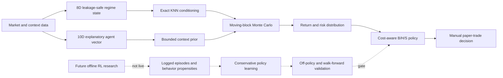

# Quantitative Decision Research Notes

## Regime-conditioned Monte Carlo now; conservative offline RL only after validation

**Status:** `RESEARCH_ONLY`

**Live engine:** regime-conditioned moving-block Monte Carlo

**Live RL:** disabled

**Execution scope:** manual paper trading only

These notes define the mathematical contract of the Agent Trading model. They distinguish what is implemented from what is proposed. The current model estimates a conditional return distribution and applies a conservative decision rule. It does **not** learn an action-value function, improve a policy from episodes, or satisfy the definition of reinforcement learning.

The central research question is:

> Given the information observable at decision time, what distribution of net 10-session outcomes followed comparable completed regimes, and is that evidence strong enough to justify changing a long-only paper position?

The result is decision support—not a price target, calibrated win rate, guarantee, fiduciary recommendation, or authorization to trade real capital.

---

## 1. System boundary

The application contains three related but separate layers:



1. The **agent vector** summarizes current technical and perception evidence for explanation.
2. The **Monte Carlo risk engine** uses a separately defined, historically reproducible state to condition return paths.
3. The **decision policy** maps the simulated distribution to Buy/Hold/Sell guidance after costs.
4. The proposed **offline RL layer** remains disabled until logged episodes, a position-aware environment, off-policy evaluation, and independent validation exist.

This separation prevents an explanatory LLM or headline score from silently becoming an execution policy.

---

## 2. Notation

| Symbol | Meaning |
|---|---|
| $t$ | decision timestamp based on a completed daily bar |
| $H$ | forecast horizon; currently 10 sessions |
| $M$ | number of simulated paths; currently 3,000 |
| $K$ | maximum nearest regimes; currently 80 |
| $B$ | moving-block size; currently 3 sessions |
| $P_t$ | adjusted closing price at $t$ |
| $V_t$ | reported volume at $t$ |
| $r_t$ | one-session log return, $\log(P_t/P_{t-1})$ |
| $x_t$ | 8D historical regime state used by Monte Carlo |
| $z_t$ | 10D explanatory agent vector shown in the UI |
| $c_t$ | bounded context score in $[-1,1]$ |
| $R_T^{(m)}$ | terminal simple return for simulated path $m$ |
| $\kappa$ | estimated round-trip decision cost; currently 15 bps |
| $\theta$ | directional probability gate; currently 0.58 |

All rolling features at time $t$ use observations with timestamp $\leq t$. A historical state is eligible only when its complete future label window $t+1,\ldots,t+H$ is already observed.

---

## 3. Current explanatory agent state

The UI displays a technical vector and perception vector:

$$
z_t = [z_t^{\text{technical}}, z_t^{\text{perception}}] \in [-1,1]^{10}.
$$

### 3.1 Technical 5D vector

The axes are price action, volume participation, range/volatility, moving-average momentum, and a technical market proxy. The components are clipped to $[-1,1]$ before display.

### 3.2 Perception 5D vector

The axes are domestic market, sector peers, international market, news/events, and time regime. Missing or non-finite values are converted to neutral zero rather than allowed to propagate through the policy.

### 3.3 Context prior

The Monte Carlo state already contains technical market information, so the technical mean is not added again. Only perception plus evaluated memory forms a small prior:

$$
c_t = \mathrm{clip}\left(0.8\,\overline{z_t^{\text{perception}}} + m_t, -1, 1\right),
$$

where $m_t \in [-0.12,0.12]$ is the bounded memory adjustment. This prior may move the full 10-session distribution by at most 25 bps:

$$
\Delta_{\text{context}} = c_t \times 0.0025.
$$

The daily log-return shift is $\Delta_{\text{context}}/H$. This is deliberately too small to override the empirical historical distribution.

---

## 4. Historical regime state

The Monte Carlo engine constructs

$$
x_t = [r_{1,t}, r_{5,t}, m_{20,t}, q_{20/60,t}, \sigma_{20,t}, \nu_t, d_{60,t}, v_t] \in \mathbb{R}^{8}.
$$

The implemented components are:

1. **One-day log return**

   $$r_{1,t}=\log(P_t/P_{t-1}).$$

2. **Five-day log return**

   $$r_{5,t}=\log(P_t/P_{t-5}).$$

3. **Twenty-day momentum relative to the simple average**

   $$m_{20,t}=\frac{P_t}{\mathrm{SMA}_{20}(P)_t}-1.$$

4. **20/60 exponential trend spread**

   $$q_{20/60,t}=\frac{\mathrm{EMA}_{20}(P)_t}{\mathrm{EMA}_{60}(P)_t}-1.$$

5. **Annualized 20-day realized volatility**

   $$\sigma_{20,t}=\sqrt{252}\;\mathrm{Std}(r_{t-19:t}).$$

6. **Volatility regime**

   $$\nu_t=\log\left(\frac{\sigma_{20,t}}{\sigma_{60,t}}\right).$$

7. **Sixty-day drawdown**

   $$d_{60,t}=\frac{P_t}{\max(P_{t-59:t})}-1.$$

8. **Volume shock relative to the rolling median**

   $$v_t=\log\left(\frac{V_t}{\mathrm{Median}(V_{t-19:t})}\right).$$

Rows containing undefined or infinite values are rejected after the rolling warm-up.

---

## 5. Robust scaling and exact nearest-regime search

Let $\mathcal{C}_T$ be the candidate set at current time $T$. A candidate date $i$ is allowed only when $i+H \leq T$; therefore every selected state has a fully observed forward path.

For feature $j$, compute the candidate median $\mu_j$ and interquartile range $s_j$:

$$
\mu_j = \mathrm{Median}_{i\in\mathcal{C}_T}(x_{i,j}), \qquad
s_j = Q_{0.75}(x_{\cdot,j})-Q_{0.25}(x_{\cdot,j}).
$$

The robust-scaled state is

$$
\widetilde{x}_{i,j}=\frac{x_{i,j}-\mu_j}{\max(s_j,\epsilon)}.
$$

Squared Euclidean distance from the current state is

$$
d_i=\lVert\widetilde{x}_i-\widetilde{x}_T\rVert_2^2.
$$

The engine uses FAISS `IndexFlatL2`, which is an exhaustive exact search. With roughly one thousand daily candidates, an approximate index would add operational complexity without a useful retrieval advantage.

The $K$ smallest-distance regimes receive temperature-scaled weights:

$$
\tau=\mathrm{Median}\{d_i:d_i>0\}, \qquad
w_i=\frac{\exp(-d_i/\max(\tau,\epsilon))}{\sum_{j=1}^{K}\exp(-d_j/\max(\tau,\epsilon))}.
$$

The effective neighbor count is

$$
N_{\text{eff}}=\frac{1}{\sum_{i=1}^{K}w_i^2}.
$$

Reporting $N_{\text{eff}}$ matters: requesting 80 neighbors does not mean 80 regimes contribute meaningfully if a few weights dominate.

---

## 6. Weighted moving-block Monte Carlo

For each eligible regime $i$, store its observed forward log-return path

$$
y_i=[r_{i+1},r_{i+2},\ldots,r_{i+H}].
$$

For simulation $m$ and block start $b\in\{1,1+B,1+2B,\ldots\}$:

1. sample a neighbor index $I_{m,b}\sim\mathrm{Categorical}(w_1,\ldots,w_K)$;
2. copy the corresponding $B$-session return block from $y_{I_{m,b}}$;
3. continue until $H$ returns are populated.

This produces path

$$
\widetilde{y}^{(m)}=[\widetilde r_1^{(m)},\ldots,\widetilde r_H^{(m)}].
$$

The bounded context prior is applied as

$$
\widehat r_h^{(m)}=\widetilde r_h^{(m)}+\frac{\Delta_{\text{context}}}{H}.
$$

The terminal simple return is

$$
R_T^{(m)}=\exp\left(\sum_{h=1}^{H}\widehat r_h^{(m)}\right)-1.
$$

Using blocks rather than independent daily draws preserves some short-memory dependence and volatility clustering. It does not reproduce every market dependency, structural break, or cross-asset correlation; those are explicit limitations.

The random seed is derived from symbol and market date for reproducibility. Identical data, configuration, and seed produce identical paths.

---

## 7. Decision rule

Define cost-clearing probabilities

$$
p_+ = \frac{1}{M}\sum_{m=1}^{M}\mathbf{1}\{R_T^{(m)}>\kappa\},
$$

$$
p_- = \frac{1}{M}\sum_{m=1}^{M}\mathbf{1}\{R_T^{(m)}<-\kappa\}.
$$

Let $\widetilde R$ be the median simulated terminal return. The policy is

$$
\pi(x_T)=
\begin{cases}
\text{Buy}, & p_+\geq\theta \text{ and } \widetilde R>\kappa,\\
\text{Sell}, & p_-\geq\theta \text{ and } \widetilde R<-\kappa,\\
\text{Hold}, & \text{otherwise}.
\end{cases}
$$

with $\theta=0.58$. In the long-only walk-forward evaluator:

- Buy maps the target position to 1;
- Sell maps it to 0;
- Hold preserves the previous position.

Thus Sell means exit/stay flat, not open a short position.

### 7.1 Decision strength

The UI value is **decision strength**, not a calibrated probability of being correct.

For Buy or Sell, raw strength is the relevant cost-clearing probability. For Hold:

$$
q_{\text{hold}}=0.5+\max(0,\theta-\max(p_+,p_-)).
$$

The reliability terms are

$$
\rho_{\text{history}}=\min(1,N/750), \qquad
\rho_{\text{neighbor}}=\min(1,N_{\text{eff}}/40),
$$

$$
\rho=\sqrt{\rho_{\text{history}}\rho_{\text{neighbor}}}.
$$

Final strength shrinks toward 50 when evidence is thin:

$$
C=\mathrm{clip}_{[50,95]}\left(50+(100q-50)\rho\right).
$$

This number must not be presented as accuracy until an independent calibration study maps it to observed frequencies.

---

## 8. Risk estimators

Let $\widehat F_R$ be the empirical CDF of simulated terminal returns.

### 8.1 Historical simulation VaR

The lower-tail 95% VaR return is

$$
\mathrm{VaR}_{0.95}=\widehat F_R^{-1}(0.05).
$$

The API reports this as a signed return. A value of $-6.85\%$ means 5% of simulated paths finish below approximately $-6.85\%$; it does not mean losses are capped there.

### 8.2 Expected shortfall

$$
\mathrm{ES}_{0.95}=\mathbb{E}[R\mid R\leq\mathrm{VaR}_{0.95}].
$$

Expected shortfall summarizes the mean of the worst 5% of simulated terminal outcomes.

### 8.3 Path drawdown

For path wealth $W_h^{(m)}=\exp(\sum_{u=1}^{h}\widehat r_u^{(m)})$:

$$
D_h^{(m)}=\frac{W_h^{(m)}}{\max_{1\leq u\leq h}W_u^{(m)}}-1,
$$

$$
D_{\max}^{(m)}=\min_{1\leq h\leq H}D_h^{(m)}.
$$

The displayed expected maximum drawdown is $M^{-1}\sum_m D_{\max}^{(m)}$.

---

## 9. Monte Carlo simulation versus Monte Carlo RL

The two terms are related but not interchangeable.

### 9.1 Implemented Monte Carlo simulation

The live system samples plausible return paths conditional on current regime and summarizes their outcome distribution. It has no learned value function and no policy-improvement loop.

### 9.2 Monte Carlo reinforcement learning

For an episodic Markov decision process, the discounted return from step $t$ is

$$
G_t=\sum_{k=0}^{T-t-1}\gamma^k r_{t+k+1}.
$$

Monte Carlo policy evaluation estimates

$$
Q_\pi(s,a)=\mathbb{E}_\pi[G_t\mid S_t=s,A_t=a]
$$

from complete sampled episodes. An incremental update is

$$
Q(S_t,A_t)\leftarrow Q(S_t,A_t)+\alpha\left(G_t-Q(S_t,A_t)\right).
$$

Control additionally improves the policy, for example with an $\epsilon$-soft rule:

$$
\pi(a\mid s)=
\begin{cases}
1-\epsilon+\epsilon/|\mathcal{A}|, & a=\arg\max_{a'}Q(s,a'),\\
\epsilon/|\mathcal{A}|, & \text{otherwise}.
\end{cases}
$$

The removed prototype never generated training episodes, never improved a policy, never loaded a learned artifact, and queried an empty 5D index while the UI claimed a 10D model. It therefore was not RL.

---

## 10. Proposed RL formulation

RL should be treated as a separate research program rather than a label placed on the current heuristic.

### 10.1 Decision process

A practical trading problem is partially observable and non-stationary. The implementation may use an augmented MDP approximation:

$$
\mathcal{M}=(\mathcal{S},\mathcal{A},P,R,\gamma).
$$

#### State

$$
s_t=[x_t,z_t,p_t,r_t^{\text{risk}},q_t^{\text{execution}}],
$$

where:

- $x_t$: reproducible market-regime features;
- $z_t$: timestamped context features with source and publication time;
- $p_t$: portfolio state—cash ratio, current weight, average cost, unrealized P&L, holding period;
- $r_t^{\text{risk}}$: drawdown, realized volatility, concentration, liquidity, and limit utilization;
- $q_t^{\text{execution}}$: spread, volume participation, latency, and market-session state.

Every feature must carry an `available_at` timestamp. Event time and ingestion time are different fields.

#### Action

For the existing long-only simulator, use target position rather than ambiguous verbs:

$$
a_t=w_t^*\in\{0,1\}.
$$

The UI mapping is state-dependent:

| Previous position | Target | UI action |
|---:|---:|---|
| 0 | 1 | Buy |
| 1 | 0 | Sell |
| 0 | 0 | Hold |
| 1 | 1 | Hold |

A later continuous policy may use $w_t^*\in[0,w_{\max}]$, but only after liquidity and sizing constraints are modeled.

#### Execution transition

Let $\Delta w_t=w_t^*-w_{t-1}$. A simulated execution price can be modeled as

$$
\widetilde P_t=P_t\left[1+\mathrm{sign}(\Delta w_t)\left(\frac{\text{spread}_t}{2}+\eta\sqrt{\frac{|Q_t|}{\mathrm{ADV}_t}}\right)\right],
$$

where $Q_t$ is order quantity, $\mathrm{ADV}_t$ is average daily volume, and $\eta$ is estimated impact. Brokerage, STT, exchange fees, GST, stamp duty, and taxes must be explicit cost terms rather than a single generic constant.

#### Portfolio transition

For asset return $R_{t+1}$ and total proportional cost $c_t$:

$$
\frac{W_{t+1}}{W_t}=1+w_t^*R_{t+1}-c_t|\Delta w_t|.
$$

The environment must reject infeasible actions before reward calculation.

#### Reward

A stable additive reward should start from net log wealth:

$$
r_{t+1}=\log\left(\frac{W_{t+1}}{W_t}\right)
-\lambda_D\max(0,D_{t+1}-D^*)
-\lambda_V\,\text{Violation}_{t+1}.
$$

Costs are already embedded in $W_{t+1}$ and should not be subtracted twice. $D^*$ is a pre-registered drawdown budget; `Violation` covers concentration, liquidity, or exposure breaches. A per-step Sharpe ratio is avoided because it is non-additive and unstable.

For risk-sensitive research, optimize a constrained objective such as

$$
\max_\pi\;\mathbb{E}_\pi[G_0]
\quad\text{subject to}\quad
\mathrm{CVaR}_{0.95}(-G_0)\leq L_{\max}.
$$

The constraint and penalty coefficients must be frozen before the final test set is opened.

---

## 11. Recommended learning algorithm: conservative offline RL

Live exploratory RL is inappropriate for a trading application. Training should begin offline from immutable paper-trading and historical episodes.

Let

$$
\mathcal D=\{(s_t,a_t,r_{t+1},s_{t+1},d_t,\mu(a_t\mid s_t))\}
$$

contain transitions, terminal flag $d_t$, and behavior-policy propensity $\mu$. Without behavior propensities, reliable importance-weighted off-policy evaluation is not available.

Standard off-policy Q-learning can overestimate actions rarely represented in $\mathcal D$. Conservative Q-Learning adds a penalty that lowers unsupported action values. A discrete-action form is

$$
\min_Q\;\alpha\,\mathbb{E}_{s\sim\mathcal D}
\left[\log\sum_a e^{Q(s,a)}-\mathbb{E}_{a\sim\mathcal D(\cdot\mid s)}Q(s,a)\right]
+\frac{1}{2}\mathbb{E}_{(s,a,r,s')\sim\mathcal D}
\left[Q(s,a)-\left(r+\gamma\mathbb{E}_{a'\sim\pi}Q_{\bar\theta}(s',a')\right)\right]^2.
$$

The first term penalizes high value assigned to actions outside the logged behavior distribution; the second is a Bellman regression term. This does not make offline RL automatically safe. Dataset coverage, reward correctness, non-stationarity, and evaluation error remain dominant risks.

An alternative first milestone is a contextual bandit or fitted-Q baseline. The most complex model should not be selected unless it beats simpler frozen baselines out of sample.

---

## 12. Off-policy evaluation

A candidate RL policy must be evaluated without executing it. Let

$$
\rho_{1:t}=\prod_{u=1}^{t}\frac{\pi(a_u\mid s_u)}{\mu(a_u\mid s_u)}
$$

be the cumulative importance ratio. A sequential doubly robust estimator combines importance weighting with learned value models:

$$
\widehat V_{\text{DR}}=\frac{1}{n}\sum_{i=1}^{n}
\left[
\widehat V(s_1^{(i)})+
\sum_{t=1}^{T}\gamma^{t-1}\rho_{1:t}^{(i)}
\left(r_t^{(i)}+\gamma\widehat V(s_{t+1}^{(i)})-\widehat Q(s_t^{(i)},a_t^{(i)})\right)
\right].
$$

The evaluation report should include ordinary importance sampling, weighted importance sampling, direct-model estimates, doubly robust estimates, effective sample size, confidence intervals, and disagreement between estimators. A policy fails closed when support is weak or estimators materially disagree.

---

## 13. Leakage-safe research protocol

### 13.1 Dataset contract

Each row must record:

- `event_time`—when the market event happened;
- `available_at`—when the system could have known it;
- symbol and point-in-time universe membership;
- raw and adjusted prices plus corporate-action version;
- feature-code version and dataset checksum;
- action, behavior propensity, requested quantity, simulated fill, and costs;
- portfolio state before and after action;
- reward components separately, not only the summed reward.

### 13.2 Chronological splitting

Never randomly shuffle overlapping financial labels. For horizon $H$:

1. train only on timestamps before the validation interval;
2. purge training observations whose label window overlaps validation;
3. add an embargo after validation when feature or label dependence can leak;
4. tune on multiple chronological validation folds;
5. open the final holdout once.

### 13.3 Baselines

Every candidate must be compared with:

- always cash;
- buy and hold;
- simple moving-average trend;
- volatility-targeted trend;
- the current conditional Monte Carlo policy;
- behavior cloning from the logged policy.

### 13.4 Metrics

Report net-of-cost:

- annualized return and volatility;
- Sharpe and Sortino ratios with sampling uncertainty;
- maximum and average drawdown;
- 95% VaR and expected shortfall;
- turnover, exposure, hit rate, payoff ratio, and profit factor;
- calibration/coverage by predicted-strength bucket;
- results by volatility, trend, liquidity, and crisis regime;
- capacity under increasing impact assumptions;
- probability of backtest overfitting and deflated Sharpe ratio when multiple configurations were tried.

No single metric is an acceptance criterion. Gates must be pre-registered before final evaluation.

---

## 14. Current walk-forward evidence

Run:

```bash
python backend/scripts/evaluate_monte_carlo.py --symbol RELIANCE.NS --period 5y --step-days 10
```

The evaluator uses expanding training windows and non-overlapping 10-session outcomes. Its long-only state machine maps Buy to invested, Sell to flat, and Hold to unchanged.

The current RELIANCE research run produced:

| Metric | Result |
|---|---:|
| Test windows | 74 |
| Directional coverage | 17.57% |
| Directional accuracy | 61.54% |
| Position changes | 6 |
| Invested windows | 31.08% |
| Cumulative policy return | -0.06% |
| Buy-and-hold return over evaluation span | +7.22% |
| Policy maximum drawdown | -18.42% |

This result does **not** pass a production gate. Directional accuracy alone is insufficient: magnitude, exposure, costs, and path risk determine portfolio outcomes. The live API therefore returns:

```json
{
  "policy_status": "RESEARCH_ONLY",
  "validation_gate": "NOT_PASSED",
  "is_reinforcement_learning": false
}
```

The appropriate research response is to improve the dataset and evaluation design—not tune thresholds repeatedly on this same history.

---

## 15. Production governance gates

Before any real-money discussion, all of the following must be satisfied:

1. **Data gate**—licensed point-in-time prices, universe membership, corporate actions, and timestamped context pass audit.
2. **Execution gate**—fees, spreads, impact, latency, partial fills, halts, and liquidity limits are modeled and stress-tested.
3. **Statistical gate**—pre-registered multi-asset walk-forward and untouched holdout results clear uncertainty and multiple-testing controls.
4. **OPE gate**—offline-RL value estimates have adequate behavior support, effective sample size, and agreement across estimators.
5. **Risk gate**—drawdown, expected shortfall, concentration, capacity, and scenario stresses remain inside documented limits.
6. **Reproducibility gate**—dataset, code, configuration, seed, model artifact, and environment are immutable and recoverable.
7. **Shadow gate**—a long paper/shadow period shows stable calibration and no material data or execution drift.
8. **Operations gate**—monitoring, kill switch, incident response, rollback, and human approval are tested.
9. **Independent review gate**—someone other than the model author reproduces the study and signs off.

Until then, the system remains manual paper-trading decision support.

---

## 16. Testing and reproducibility

Run deterministic unit and leakage tests:

```bash
python -m pytest trading_framework/tests -q
```

The tests cover:

- deterministic seeded output;
- finite and internally valid distribution statistics;
- completed forward labels and chronological ordering;
- bounded context influence;
- fail-closed behavior on insufficient history;
- chronological non-overlapping walk-forward windows.

Run the live agent pipeline directly:

```bash
python backend/scripts/run_agents.py RELIANCE.NS '{}'
```

The output includes data-through date, state features, history count, requested/effective neighbors, simulations, horizon, block size, cost assumption, context shift, seed, and model status.

---

## 17. References

1. Sutton, R. S., and Barto, A. G. *Reinforcement Learning: An Introduction*, 2nd ed., especially Chapter 5 on Monte Carlo methods. https://www.incompleteideas.net/book/the-book-2nd.html
2. Meta AI. *FAISS Getting Started* and exact `IndexFlatL2` search. https://github.com/facebookresearch/faiss/wiki/Getting-started
3. Kumar, A., Zhou, A., Tucker, G., and Levine, S. *Conservative Q-Learning for Offline Reinforcement Learning*. https://arxiv.org/abs/2006.04779
4. Jiang, N., and Li, L. *Doubly Robust Off-policy Value Evaluation for Reinforcement Learning*. ICML 2016. https://proceedings.mlr.press/v48/jiang16.html
5. Bellemare, M. G., Dabney, W., and Munos, R. *A Distributional Perspective on Reinforcement Learning*. https://arxiv.org/abs/1707.06887
6. Tamar, A., Glassner, Y., and Mannor, S. *Optimizing the CVaR via Sampling*. AAAI 2015. https://ojs.aaai.org/index.php/AAAI/article/view/9561
7. Bailey, D. H., Borwein, J., López de Prado, M., and Zhu, Q. J. *The Probability of Backtest Overfitting*. https://ssrn.com/abstract=2326253
8. Bailey, D. H., and López de Prado, M. *The Deflated Sharpe Ratio: Correcting for Selection Bias, Backtest Overfitting and Non-Normality*. https://ssrn.com/abstract=2460551

These works motivate the methodology and safeguards; they do not validate this application or its trading performance.
